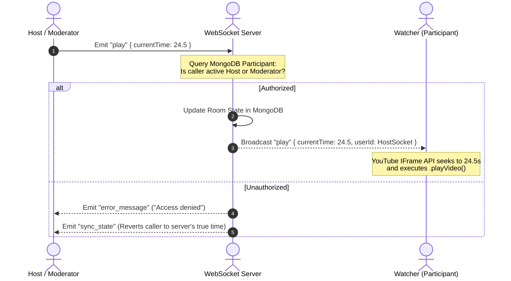

# 🍿 SyncParty - Real-Time Synced YouTube Watch Platform

SyncParty is a production-ready, full-stack MERN platform that allows multiple users to stream YouTube videos simultaneously in perfect, real-time synchronization. Complete with secure JWT sessions, MongoDB persistence, password-protected lobbies, and role-based action privileges, it provides a premium dark-mode glassmorphic streaming experience.

---

## 🏗️ System Architecture

SyncParty is built on a hybrid architecture combining a high-performance **Express + Node.js REST API** with a real-time bi-directional **Socket.IO WebSocket Server**, backed by a secure **MongoDB** persistence layer.

```
       +-------------------------------------------------------------+
       |                        Vite + React.js                      |
       |                   (Custom Glassmorphic UI)                  |
       +------------------------------+------------------------------+
                                      |
                     REST (JWT)       |       Socket.IO (Handshake JWT)
                +---------------------+---------------------+
                |                                           |
                v                                           v
       +--------+--------+                         +--------+--------+
       |   Express.js    |                         |    Socket.IO    |
       |  (REST Router)  |                         | (WS Controller) |
       +--------+--------+                         +--------+--------+
                |                                           |
                +---------------------+---------------------+
                                      |
                                      v
                             +--------+--------+
                             |     Mongoose    |
                             | (MongoDB Layer) |
                             +--------+--------+
```

### ⚡ WebSocket Event Flow

When synchronized commands are sent, the backend validates credentials against the database before executing broadcasts to prevent playback loops:



---

## 🗄️ Database Schemas (Mongoose)

### 1. User
Stores registration details and password hashes:
* `username` (String, unique, index) - Display name.
* `email` (String, unique, lowercase) - Session identifier.
* `password` (String, hashed via bcrypt) - Secure password.
* `avatarUrl` (String) - Path/URI to avatar.

### 2. Room
Stores synchronized state and access control criteria:
* `code` (String, unique, index) - 6-character unique uppercase room identifier.
* `hostId` (ObjectId, ref to User) - Current owner.
* `videoId` (String) - Active YouTube ID.
* `playState` (String: `'PLAYING' | 'PAUSED'`) - Status of player.
* `currentTime` (Number) - Playback timeline in seconds.
* `lastUpdated` (Date) - Sync timestamp.
* `isPasswordProtected` (Boolean) - Password gate toggle.
* `password` (String, hashed) - Credentials for private parties.

### 3. Participant
Associates connected socket sessions with rooms:
* `roomId` (ObjectId, ref to Room) - Target watch party.
* `userId` (ObjectId, ref to User) - User details.
* `socketId` (String) - Active Socket connection ID.
* `role` (String: `'Host' | 'Moderator' | 'Participant'`) - Permissions tier.
* `isActive` (Boolean) - Connection health indicator.

### 4. Message
Persists chat dialogue:
* `roomId` (ObjectId, ref to Room) - Party channel.
* `userId` (String) - Senders socket ID or `'system'`.
* `username` (String) - Handle to display.
* `role` (String) - Role at time of dispatch.
* `message` (String) - Input content.

---

## 🔒 Role-Based Access Control (RBAC) Validation

We enforce strict validation gates directly in our database and WebSocket managers before broadcasting playback controls or roster shifts:

| Permission | Host | Moderator | Participant |
| :--- | :---: | :---: | :---: |
| Play / Pause / Seek | ✅ | ✅ | ❌ |
| Sync New Video | ✅ | ✅ | ❌ |
| Manage Roles (Promote/Demote) | ✅ | ❌ | ❌ |
| Kick Watchers | ✅ | ❌ | ❌ |
| Transfer Host Status | ✅ | ❌ | ❌ |
| Submit Live Chat & Reactions | ✅ | ✅ | ✅ |

---

## 🚀 Setup & Execution Guide

### Prerequisites
* **Node.js** (v18+ recommended)
* **npm** (v9+ recommended)
* **MongoDB** (Local instance running, or MongoDB Atlas connection string)

### 1. Environment Configuration
Create a `.env` file in the `server` directory (reference `.env.example` in this directory):
```env
PORT=4000
MONGODB_URI=mongodb://127.0.0.1:27017/watchparty
JWT_SECRET=yoursupersecurejwtsecretkey
```

### 2. Automatic Dependency Assembly
From the root monorepo directory, run the installer script:
```bash
npm run install:all
```

### 3. Launch Development Environments
Start both the backend server and Vite frontend concurrently:
```bash
npm run dev
```
* **Frontend**: `http://localhost:5173`
* **Backend**: `http://localhost:4000`

---

## 🌐 Production Deployment Steps

### Part A: Database Provisioning (MongoDB Atlas)
1. Register a free account on [MongoDB Atlas](https://www.mongodb.com/cloud/atlas).
2. Create a Shared Cluster and setup database user credentials.
3. Whitelist access IP address `0.0.0.0/0` (all paths).
4. Copy the connection string (e.g. `mongodb+srv://<user>:<password>@cluster.mongodb.net/watchparty`).

### Part B: Backend Hosting (Render or Railway)
1. Connect your GitHub repository to Render/Railway.
2. Set Environment Variables:
   - `NODE_ENV=production`
   - `MONGODB_URI=your_atlas_connection_string`
   - `JWT_SECRET=your_long_secure_production_secret`
3. Configure settings:
   - Build Command: `npm run build:frontend` (Vite compiles static assets directly into the server monorepo structure)
   - Start Command: `npm start` (Runs Node.js server starting `server/src/index.js`, serving the REST API, Socket.IO pipelines, and static assets concurrently)

### Part C: Static Assets Integration
By default, the server is configured to serve the compiled frontend production bundle (`frontend/dist`) statically. This means deploying the monorepo to Render or Railway will yield **both a running backend and a fully functional frontend hosted on a single domain**, removing CORS issues and optimizing socket connection speed!
